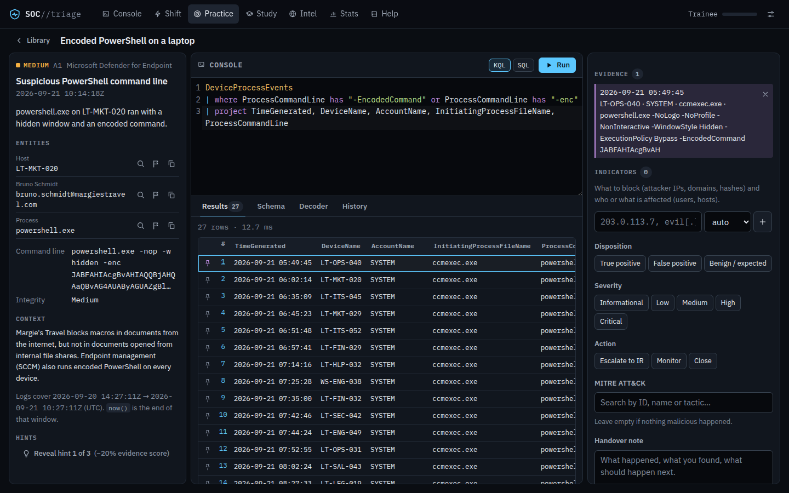
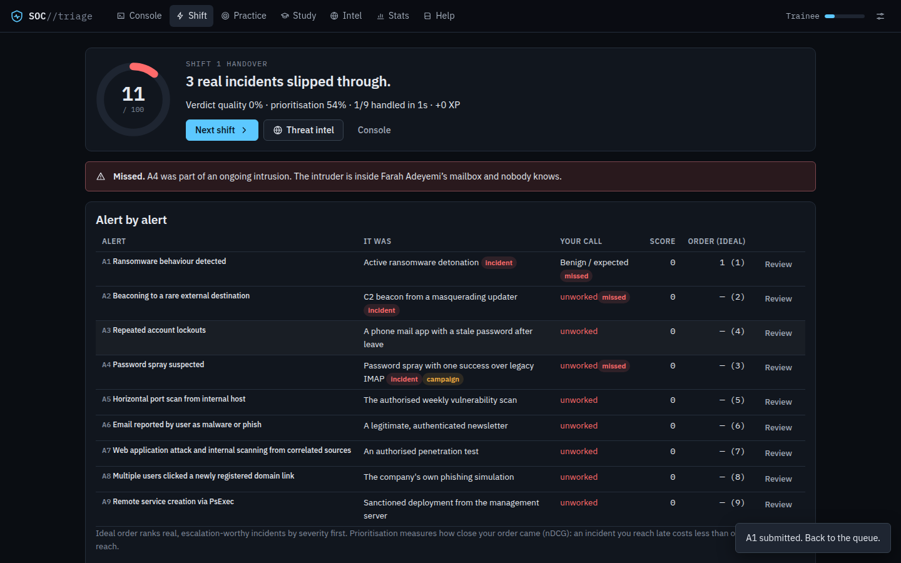
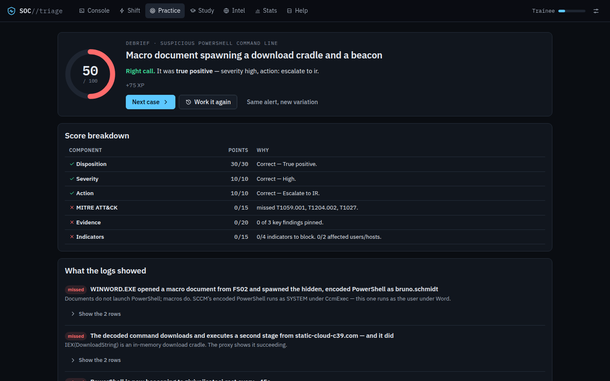

# SOC Triage Simulator

A training SOC in your browser. Alerts fire in a fictional company; behind each
one is a full day of that company's logs — thousands of rows of sign-ins,
endpoint processes, email, proxy, DNS and firewall traffic, most of it
perfectly ordinary. You investigate with **real KQL** (or SQL) in a SIEM
console that runs entirely client-side, pin the rows that prove your case,
pull out the indicators worth blocking, and make the call. The debrief shows
what you found, what you missed, and how a senior analyst would have run it —
as queries you can run against the same logs.

Built as a study companion for **CompTIA CySA+ (CS0-003)** and for anyone
ramping into a SOC analyst role. No backend, no account, works offline;
nothing leaves your machine.



## What you do

- **Work shifts.** Six to nine alerts land in one queue, sharing one set of
  logs — the noise of one alert is the background of another. One to three are
  real; the rest are benign look-alikes and routine tickets. A clock runs
  (20/30/45 minutes or untimed). The handover grades every verdict and how
  well you **prioritised**: the real incidents are worth more, and worth more
  the sooner you reach them.
- **Face a campaign.** A fictional threat actor works through a kill chain
  against your company, one step per shift, on the same victim and
  infrastructure. Escalate a step and incident response contains it — the
  actor burns what you blocked, pivots to a new victim and starts over, and
  eventually gives up. Miss it and it moves on. The indicators you report land
  in the `ThreatIntel` table on your next shift; every verdict you give,
  including the wrong ones, appears in `IncidentHistory`.
- **Study.** Every case type is a spaced-repetition card (SM-2). Due reviews
  come first; new picks lean toward your weakest ATT&CK tactics, CySA+ domains
  and alert categories.
- **Practise** any of 21 alert types (25 scenarios — several detections come
  as twins with opposite answers), or the **case of the day**, which is the
  same for everyone.



## Why it's different

**A real SIEM, not a slideshow.** The console is [sql.js](https://sql.js.org)
(SQLite compiled to WebAssembly) in a Web Worker, fed with a generated corpus
in a Sentinel/Defender-style schema (18 tables). KQL is parsed by a Pratt
parser and transpiled to SQLite: `where`, `project`, `extend`, `summarize`
with `bin()`, `join`, `search`, `let`, `arg_max`, `prev()/next()`,
`render timechart` and ~60 functions and operators, with did-you-mean errors
underlined in the editor. Every example in the in-app reference is executed by
the test suite.

**You have to find it.** The evidence is not handed to you. The noise contains
deliberate decoys that resemble every signal — SCCM's encoded PowerShell,
the authorised vulnerability scanner, the VPN's cloud egress in another
country, users who really are travelling. Twins differ only in context you
must look up: change tickets, device inventory, identity data.

**Graded on the investigation, not just the answer.** 100 points: disposition
30, severity 10, action 10, ATT&CK 15, **evidence pinned 20, indicators 15**.
Indicators are matched however you write them (defanged, as URLs,
`DOMAIN\user`, FQDNs) — and reporting your own office's IP or the sanctioned
scanner costs points.

**Synthetic by construction.** Organisations are Microsoft's fictitious
companies; external addresses come only from the RFC 5737 documentation
ranges (and `2001:db8::/32`), internal ones from RFC 1918, ASNs from the
private range; attacker domains and hashes are generated; threat actors are
invented. A test scans every cell of every generated corpus to keep it that
way. Attacker activity appears only as a defender sees it in telemetry.

**Accessible and offline.** Keyboard-complete (the editor never traps Tab),
screen-reader labelled, usable at 360 px, light and dark themes, reduced
motion respected, sound off by default. After the first visit a service
worker keeps the whole thing — SIEM included — available offline.



## Quick start

Requires [Node.js](https://nodejs.org) 22.12 or newer.

```bash
npm install
npm run dev          # http://localhost:5173
```

| Script | What it does |
|---|---|
| `npm run dev` | Development server |
| `npm run build` | Typecheck, then production build into `dist/` |
| `npm run preview` | Serve `dist/` locally (the service worker only runs in a build) |
| `npm test` | Unit and scenario tests (Vitest) |
| `npm run test:e2e` | End-to-end and accessibility tests (Playwright + axe) against the production build |
| `npm run typecheck` | TypeScript, app and tests |

For the end-to-end tests, install a browser once with
`npx playwright install chromium`, or point `PW_CHROMIUM_PATH` at an existing
Chromium.

## How it's tested

- **Every scenario, every seed.** For each template the harness builds cases
  across several worlds and seeds, runs its reference investigation against a
  real SQLite database and requires it to surface every evidence row and every
  indicator the grade expects; checks that the perfect answer scores exactly
  100 and an untouched alert 0; scans every generated cell for non-synthetic
  data; sweeps 30 more seeds for crashes; and checks determinism.
- **Shifts and campaigns** are built end to end — every case in a shared
  corpus must stay solvable — and whole campaigns are played through (miss
  everything → breach on one foothold; contain everything → eviction).
- **The engine**: KQL lexer/parser/transpiler semantics, the read-only SQL
  guard, grading, SM-2, profile migration from v1.
- **The app** (Playwright): full investigation and shift flows, persistence,
  keyboard access, phone width, reduced motion, blocked storage, offline play,
  and axe accessibility scans of every screen in both themes.

CI runs all of it on every pull request.

## The case types

| Alert | Category | Tier |
|---|---|---|
| Atypical travel sign-in (twins) | Identity & Access | 2 |
| Failed sign-ins across many accounts | Identity & Access | 2 |
| Failed RDP logons on the jump host | Identity & Access | 1 |
| Burst of MFA push notifications | Identity & Access | 3 |
| Repeated account lockouts | Identity & Access | 1 |
| User-reported email (twins) | Phishing & Email | 1 |
| Attachment removed after delivery | Phishing & Email | 2 |
| Many users clicked a new domain | Phishing & Email | 1 |
| Encoded PowerShell on a laptop | Malware & Endpoint | 2 |
| certutil file download | Malware & Endpoint | 2 |
| Malware detection on an endpoint | Malware & Endpoint | 2 |
| New scheduled task running PowerShell | Persistence | 2 |
| PsExec service installed remotely (twins) | Lateral Movement | 3 |
| Horizontal port scan from an internal address (twins) | Reconnaissance | 2 |
| Coordinated recon and exploitation attempts | Reconnaissance | 2 |
| Unusual DNS query volume | Command & Control | 3 |
| Periodic outbound connections | Command & Control | 3 |
| Member added to Domain Admins | Privilege Escalation | 2 |
| Large upload to a file-sharing site | Data Exfiltration | 2 |
| Threat hunt: outbound data movement | Data Exfiltration | 3 |
| Mass file modification on a file server | Ransomware | 1 |

Answers are deliberately not listed — "twins" fire the same alert with
opposite verdicts, and the titles are neutral on purpose.

## Project layout

```
src/
  core/                pure TypeScript, no DOM — runs in the browser, the worker and Node
    synth/             the synthetic-data policy: address pools, fictitious orgs, names, geo, domains
    world/             the persistent organisation: people, hosts, sites, VPN, partners
    logs/              schema (18 tables), corpus builder, noise generators with decoys
    query/             KQL lexer, parser, transpiler, reference; SQL guard; sql.js engine
    cases/             template model, picker, attacker infra, scenario builder, 25 templates
    grading/           verdict grading, indicator matching
    shift/  campaign/  study/   the game engines
  state/               profile v2, storage, v1 migration
  ui/                  Preact app — screens, components, the SIEM worker, styles
tests/                 Vitest: engine, scenarios, shifts, campaigns, grading, profile
e2e/                   Playwright + axe
```

[`ARCHITECTURE.md`](ARCHITECTURE.md) explains the design: the world and log
model, the case template contract, the query engine, grading, and the shift,
campaign and study engines.

## Adding a scenario

A scenario is a `CaseTemplate` in `src/core/cases/templates/`. Its `build(ctx)`
writes the attack (or the innocent explanation) into the shared corpus
through the corpus builder, and returns the alert, the answer key, handles on
the evidence rows, the indicators (to block, in scope, and must-not-flag), a
reference investigation in KQL, hints and the debrief text. The picker gives
it people and hosts from the world (and the campaign's foothold, when it is
part of one); `ctx.infra` mints attacker IPs, domains and hashes that respect
the synthetic-data policy. Register it in `templates/index.ts`, add a line to
a `tests/scenarios/*.test.ts` file, and the harness will tell you if the case
is unsolvable, leaks, or scores a perfect answer below 100.

## Deploying

`ci.yml` runs typecheck, tests, build and the end-to-end suite on pull
requests. `deploy.yml` publishes to GitHub Pages and is **manual**
(Actions → Deploy to GitHub Pages → Run workflow); it builds with
`GITHUB_PAGES=1`, which sets the base path to `/SOC-Triage-Simulator/`.
Pages on a private repository needs a paid GitHub plan. Any static host works:
serve `dist/`.

## Data and privacy

Everything is generated in your browser and none of it is real — see
Help → About the data in the app. Progress lives in this browser's local
storage (`soc-triage-sim:v2`); a v1 profile is migrated automatically and
kept as a backup. Export and import are in Settings. There is no server, no
account and no tracking.

MITRE ATT&CK® is a registered trademark of The MITRE Corporation; CySA+ is a
trademark of CompTIA. This project is not affiliated with either.

## License

MIT — see [LICENSE](LICENSE).
