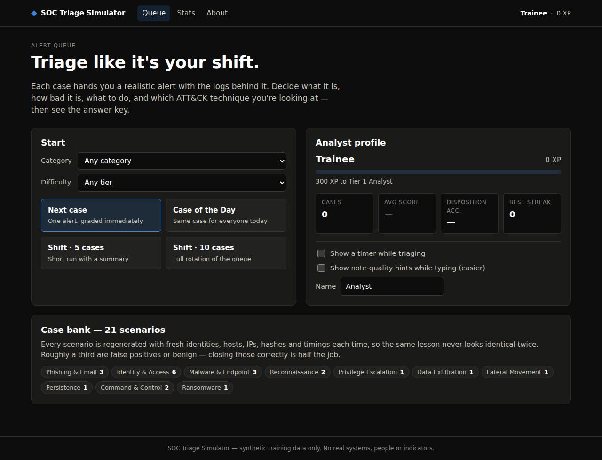
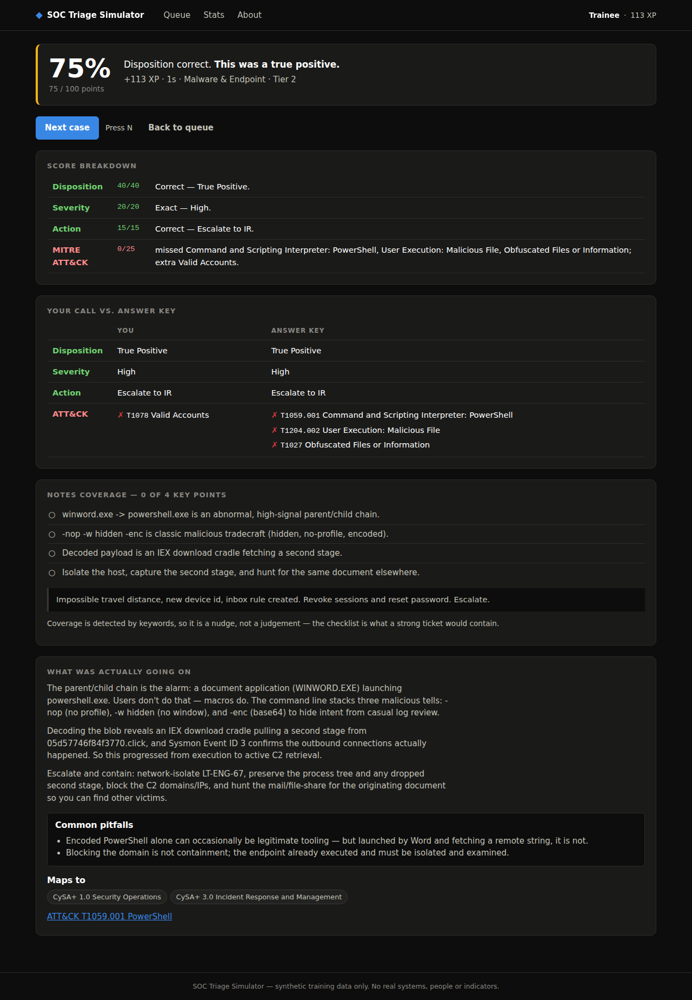
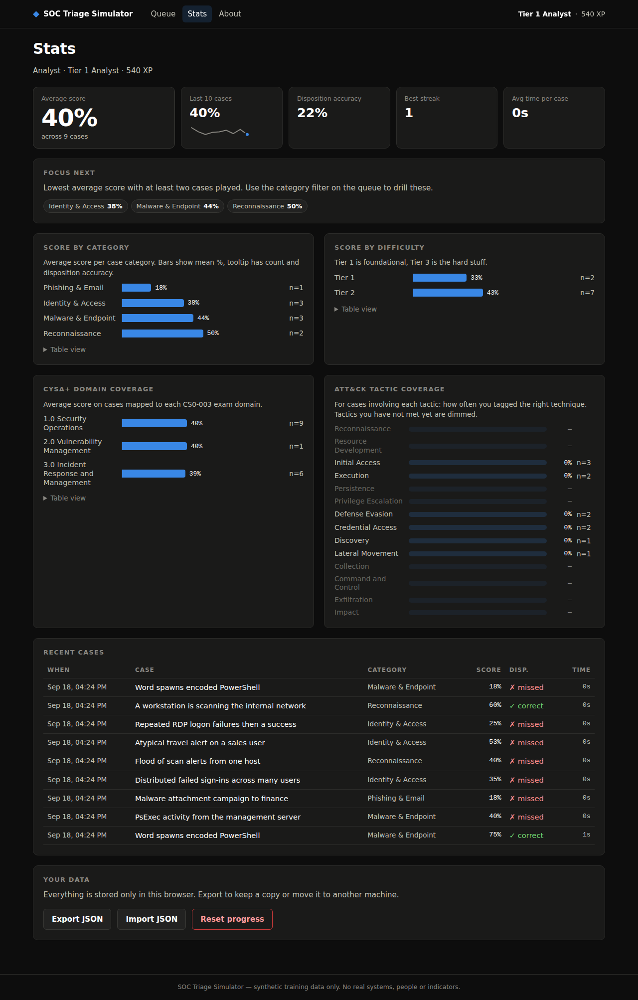

# SOC Triage Simulator

A practice queue for security analysts. Every case is a realistic, synthetic alert with the evidence behind it — Windows Security and Sysmon events, Entra ID sign-in logs, email headers, proxy/firewall/DNS records, EDR detections — and you triage it the way you would on shift:

1. **Disposition** — true positive, false positive, or benign/expected?
2. **Severity** — informational through critical
3. **Action** — close, monitor, or escalate to IR
4. **MITRE ATT&CK** — tag the technique(s) the adversary used
5. **Notes** — write the ticket

Then you get the answer key: a scored breakdown, your call vs. the correct one, a checklist of what a strong write-up would have covered, and a plain-language explanation of what was actually going on and why. Progress is tracked by category, difficulty, CySA+ domain and ATT&CK tactic, so you can see where to drill.

Built as a study companion for **CompTIA CySA+ (CS0-003)** and for anyone ramping into a SOC analyst role. Runs entirely in the browser — no backend, no accounts, nothing leaves your machine.



## Quick start

```bash
npm install
npm run dev        # http://localhost:5173
```

Other scripts:

```bash
npm test           # deterministic smoke test across every scenario x 40 seeds
npm run typecheck  # tsc --noEmit
npm run build      # production build into dist/
npm run preview    # serve dist/ locally
```

Requires Node 22+ (the test runner uses Node's built-in TypeScript stripping).

## What makes it useful

**Cases regenerate.** Each scenario is a generator, not a static file. Identities, hostnames, IPs, hashes, domains, timings and geography are produced from a seeded RNG every time, so the *lesson* repeats but the *data* never looks identical — you learn the pattern, not the answer. Cases are reproducible from their ID, and "Case of the Day" gives everyone the same case on a given date.

**Twins.** Several alerts come in pairs that look the same and mean the opposite: atypical travel that is an account takeover vs. the corporate VPN; PsExec from an attacker vs. from the management server under change control; a workstation port-scanning vs. the authorised vulnerability scanner. Roughly a third of scenarios are benign or false positives, because confidently closing a non-incident is the skill that separates a good Tier 1 from a noisy one.

**Honest grading.** The objective fields carry the score (100 points: disposition 40, severity 20, action 15, ATT&CK 25) with partial credit where it makes sense — one severity level off, the adjacent action, a parent technique instead of the sub-technique. Notes are keyword-matched against a rubric for a small XP bonus and shown as a coaching checklist rather than pretending to grade prose.

**Study mapping.** Every scenario is tagged with CySA+ CS0-003 domains and MITRE ATT&CK Enterprise techniques; the picker carries ~60 techniques so wrong answers are possible. The stats page rolls this up into per-domain scores and a tactic-coverage view.





## Scenarios

| Scenario | Category | Tier |
|---|---|---|
| Atypical travel sign-in to Microsoft Entra ID | Identity & Access | Tier 2 |
| Distributed failed sign-ins across many users | Identity & Access | Tier 2 |
| Repeated RDP logon failures then a success | Identity & Access | Tier 1 |
| Burst of MFA push notifications, then an approval | Identity & Access | Tier 3 |
| Atypical travel alert on a sales user | Identity & Access | Tier 2 |
| Repeated lockouts on a returning employee | Identity & Access | Tier 1 |
| Reported email with a credential-harvesting link | Phishing & Email | Tier 1 |
| Malware attachment campaign to finance | Phishing & Email | Tier 2 |
| User-reported "phishing" newsletter | Phishing & Email | Tier 1 |
| Word spawns encoded PowerShell | Malware & Endpoint | Tier 2 |
| certutil used to download a payload | Malware & Endpoint | Tier 2 |
| New scheduled task running a hidden script | Persistence | Tier 2 |
| PsExec activity from the management server | Malware & Endpoint | Tier 2 |
| A workstation is scanning the internal network | Reconnaissance | Tier 2 |
| Flood of scan alerts from one host | Reconnaissance | Tier 1 |
| Abnormal DNS query volume and entropy | Command & Control | Tier 3 |
| Periodic outbound connections with fixed cadence | Command & Control | Tier 3 |
| PsExec from a user workstation to a domain controller | Lateral Movement | Tier 3 |
| Account added to Domain Admins outside change control | Privilege Escalation | Tier 2 |
| Large upload to personal cloud storage | Data Exfiltration | Tier 2 |
| Mass file modification on a file server | Ransomware | Tier 1 |

Answers are deliberately not listed here — they're in the app once you submit.

## Modes

- **Next case** — one alert, graded immediately, then another. Category and difficulty filters apply.
- **Case of the Day** — deterministic from the date; same case for everyone, once per day.
- **Shift (5 / 10)** — a run with a summary at the end.

Optional settings: a visible timer, and live note-quality hints while typing (easier mode).

## Project layout

```
src/
  types.ts                 core types (no enums — erasable syntax only)
  data/
    mitre.ts               curated ATT&CK technique catalogue + tactic order
    cysa.ts                CySA+ CS0-003 domains
    templates/             one file per area; each scenario is a build(ctx) generator
      identity.ts  email.ts  endpoint.ts  network.ts  impact.ts  util.ts  index.ts
  engine/
    rng.ts                 seeded PRNG (mulberry32) + daily seed
    fakes.ts               synthetic identities, hosts, IPs, domains, hashes, timestamps, geo
    generator.ts           template selection, case materialisation, regenerate-from-id
    grading.ts             scoring rules, rubric keyword detection, XP
  state/
    store.ts               localStorage profile, records, ranks, export/import
    stats.ts               aggregations for the dashboard
  ui/
    app.ts                 app shell, hash routing, session/shift state
    dom.ts                 tiny hyperscript helper (textContent only — no innerHTML)
    nav.ts  screens/       home, triage, result, stats, about
scripts/smoke.ts           deterministic test run by `npm test`
```

No framework, no runtime dependencies. Vite + TypeScript for the build, vanilla DOM for the UI.

## Adding a scenario

A scenario is a `CaseTemplate` with a `build({ rng, faker })` function that returns the case body. The faker gives you a consistent environment (company, AD domain, subnet, HQ city) and generators for identities, hosts, IPs, domains, hashes and timestamps; the rng is seeded so the same seed always yields the same case.

```ts
const myCase: CaseTemplate = {
  id: 'network-my-scenario',           // unique, stable — used in case IDs and stats
  category: 'c2',
  difficulty: 'tier2',
  title: 'Short alert-style title',
  cysaDomains: ['1.0', '3.0'],
  build({ rng, faker }) {
    const host = faker.workstation();
    const c2 = faker.maliciousDomain();
    return {
      alert: `What the SIEM said about ${host}...`,
      context: `${faker.env.company} — one line of environment context.`,
      artifacts: [
        artifact('Proxy', 'raw', [`${faker.syslog(0)} ${host} -> ${c2}:443`]),
      ],
      groundTruth: { disposition: 'true-positive', severity: 'high', action: 'escalate',
                     techniques: ['T1071.001'], tactics: ['command-and-control'] },
      rubric: rubric([['id', 'A point a good analyst would note.', ['keyword', 'synonym']]]),
      explanation: ['Paragraphs of answer key.'],
      pitfalls: ['What people get wrong.'],
      references: [{ label: 'ATT&CK T1071.001', url: 'https://attack.mitre.org/techniques/T1071/001/' }],
    };
  },
};
```

Register it in `src/data/templates/index.ts`, add any new technique IDs to `src/data/mitre.ts`, and run `npm test` — the smoke test checks every template across 40 seeds for determinism, catalogue consistency, and that a perfect answer scores 100.

Keep benign/false-positive cases at `techniques: []`; the grader treats tagging a technique on a non-malicious case as an error, on purpose.

## Deploying

The repo ships with two GitHub Actions workflows:

- `ci.yml` — typecheck, test and build on every push and PR.
- `deploy.yml` — builds with `GITHUB_PAGES=1` (which sets the Vite `base` to `/SOC-Triage-Simulator/`) and publishes `dist/` to GitHub Pages on every push to `main`.

To enable: repository **Settings → Pages → Source: GitHub Actions**. The site will be at `https://<user>.github.io/SOC-Triage-Simulator/`.

If you fork under a different repo name, change `base` in `vite.config.ts`.

## Data and privacy

All identities, hosts, IPs, hashes and domains are generated on the fly and are not real. Progress lives in the browser's localStorage under `soc-triage-sim:v1`; export/import is on the Stats page. Nothing is transmitted anywhere.

## Roadmap ideas

- More scenarios (cloud/Kubernetes, OT, insider variations, more Tier 3 chains)
- Multi-stage cases where one alert leads to the next
- A "hunt" mode: no alert, just logs, find the thing
- Spaced repetition of scenarios you scored poorly on
- Optional LLM-generated free-text feedback on notes (bring your own key)

## License

MIT — see [LICENSE](LICENSE).
